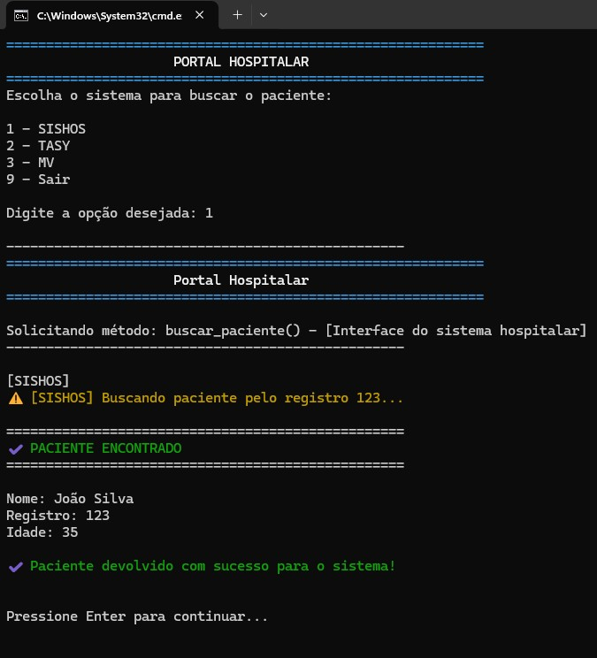
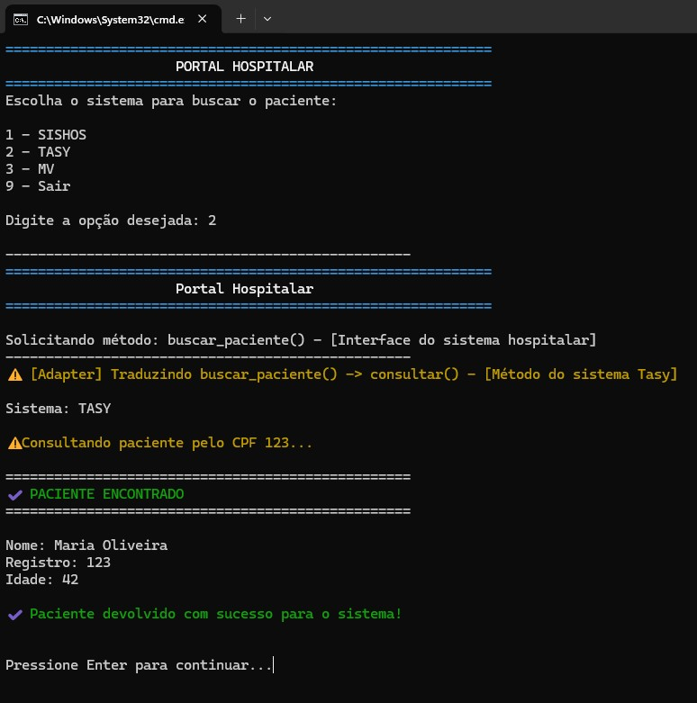
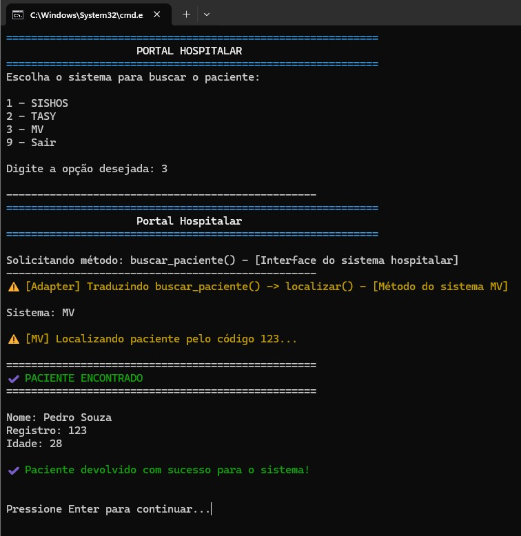

# 🏥 Adapter Pattern - Portal Hospitalar

Projeto desenvolvido para a disciplina de **Engenharia de Software II**, com o objetivo de demonstrar a aplicação do padrão de projeto **Adapter (GoF)** através da integração entre diferentes sistemas hospitalares.

---

## 📖 O problema

O Portal Hospitalar foi desenvolvido para trabalhar apenas com sistemas que implementem o método:

```python
buscar_paciente()
```

Entretanto, cada sistema hospitalar possui sua própria interface:

| Sistema |   Método utilizado  |
|---------|---------------------|
|  SISHOS | `buscar_paciente()` |
|   TASY  |    `consultar()`    |
|    MV   |    `localizar()`    |

Sem um Adapter, o Portal Hospitalar não consegue se comunicar diretamente com os sistemas TASY e MV.

---

## ❌ Sem Adapter

Ao tentar integrar diretamente o sistema TASY ao Portal Hospitalar, ocorre um erro, pois o método esperado não existe.


---

## ✅ Com Adapter

O Adapter traduz a chamada realizada pelo Portal Hospitalar para o método correspondente de cada sistema.

### SISHOS
Não necessita de Adapter, pois já implementa `buscar_paciente()`.



### TASY
O Adapter traduz `buscar_paciente()` para `consultar()`.



### MV
O Adapter traduz `buscar_paciente()` para `localizar()`.



---

## 📂 Estrutura do Projeto

```text
adapter_hospital/

│── main.py
│── interface.py
│── paciente.py
│── sishos.py
│── tasy.py
│── mv.py
│── sem_adapter.py
│
├── adapter/
│   ├── adapter_tasy.py
│   └── adapter_mv.py
│
│── imagens/
│   
└── README.md
```

---

## ✅ Vantagens

- Reaproveitamento de código;
- Facilidade de manutenção;
- Integração entre sistemas diferentes;
- Redução do acoplamento.

---

## 📌 Conclusão

O padrão **Adapter** permitiu integrar sistemas com interfaces diferentes sem modificar o Portal Hospitalar ou os sistemas externos. Cada Adapter é responsável por traduzir a interface esperada pelo Portal para a interface disponibilizada por cada sistema, tornando a integração simples, organizada e de fácil manutenção.